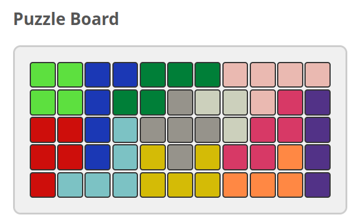

# kanoodle-solver

A solver for the 2D Kanoodle puzzle, written in Haskell, with an HTTP API and a
browser UI. Twelve irregular pieces must tile an 11x5 board exactly.

**Live demo: [kanoodle.diyarpolat.de](https://kanoodle.diyarpolat.de)**

Place a few pieces by hand, hit *Solve*, and the solver fills in the rest. Or
solve the empty board from scratch.



*An exact tiling of the empty board, found in 20 ms.*

## How it works

Tiling a board with polyominoes is an **exact cover** problem, and that is how
it is solved here rather than by ad-hoc backtracking. Every legal placement of
every piece orientation becomes a row of a matrix; the columns are the board's
empty cells plus one column per piece, so a set of rows covering each column
exactly once is precisely a solution that uses every piece and fills every cell.

`searchDLX` is Knuth's Algorithm X over that matrix, using the
minimum-remaining-values heuristic: `chooseConstrainedColumn` always branches on
the column with the fewest remaining candidate rows, and a column with no
candidates fails the branch immediately. The matrix is held as `IntMap`/`IntSet`
rather than as literal dancing-links nodes: covering a column is a set
difference instead of pointer surgery, which keeps the search purely functional
with no mutable state.

Two things happen before the search starts. Each piece's eight orientations
(four rotations × two reflections) are generated once and **deduplicated** by
normalised shape, so a symmetric piece like the 2×2 square contributes one
orientation instead of eight. And `solvePuzzle` compares the number of empty
cells against the total size of the unused pieces: if they differ the puzzle is
impossible and it returns without building a matrix at all.

An exact tiling of the empty board is found in about 20 ms; a board whose cell
counts cannot match is rejected in under 10 ms by that precondition.

## Layout

| Path | What it is |
|---|---|
| `haskell-solver/src/Kanoodle/Types.hs` | Board, piece and API types, with the JSON encoding |
| `haskell-solver/src/Kanoodle/Solver.hs` | The search. Pure: no IO, no web |
| `haskell-solver/src/Kanoodle/WebServer.hs` | servant API and static file handler |
| `gui/` | Plain HTML/CSS/JS. No build step, no dependencies |
| `deploy/` | systemd units, installer, auto-deploy script |

One server, one origin: `POST /solve` is the API and everything else is served
from `gui/`, so there is no CORS to configure.

## Running it

Needs GHC 9.4.x and cabal ([ghcup](https://www.haskell.org/ghcup/)).

```sh
cd haskell-solver
cabal build
cabal run kanoodle-solver
```

Then open <http://127.0.0.1:8080>.

Configuration is read from the environment at startup, all with defaults:

| Variable | Default | Purpose |
|---|---|---|
| `KANOODLE_HOST` | `127.0.0.1` | Bind address |
| `KANOODLE_PORT` | `8080` | Listen port |
| `KANOODLE_STATIC_DIR` | `../gui` | Directory served at `/` |
| `KANOODLE_TIMEOUT_SECONDS` | `10` | Abandons a search that runs long |

## API

`POST /solve` takes the current board and the pieces still available. An empty
cell is `{"pieceId": "", "color": ""}`.

```sh
curl -X POST http://127.0.0.1:8080/solve \
  -H 'Content-Type: application/json' \
  -d '{"board": [[{"pieceId":"","color":""}, ...]], "pieces": [...]}'
```

```json
{
  "success": true,
  "message": "Solution found!",
  "solvingTime": 20,
  "solution": [
    { "id": "C", "shape": [[1,1],[1,1]], "color": "#5de03f",
      "position": {"x": 0, "y": 0}, "rotation": 0 }
  ]
}
```

Each `shape` in the response is already in its placed orientation, so it can be
stamped onto the board at `position` directly.

## Deployment

The live demo runs on an NVIDIA Jetson Xavier NX. The server is bound to
loopback under a systemd unit that runs it unprivileged (`DynamicUser`) on a
read-only filesystem (`ProtectSystem=strict`, `NoNewPrivileges`), with CPU and
memory caps so one expensive search cannot starve the board. A timer polls the
release branch and promotes a new build only once it compiles; a failed build
leaves the running version untouched.

No port is open on the router. A Cloudflare tunnel dials outward, so nothing
on the host network is reachable from the internet.

See [`deploy/DEPLOY.md`](deploy/DEPLOY.md) for the full setup.

## License

MIT, see [LICENSE](LICENSE).
